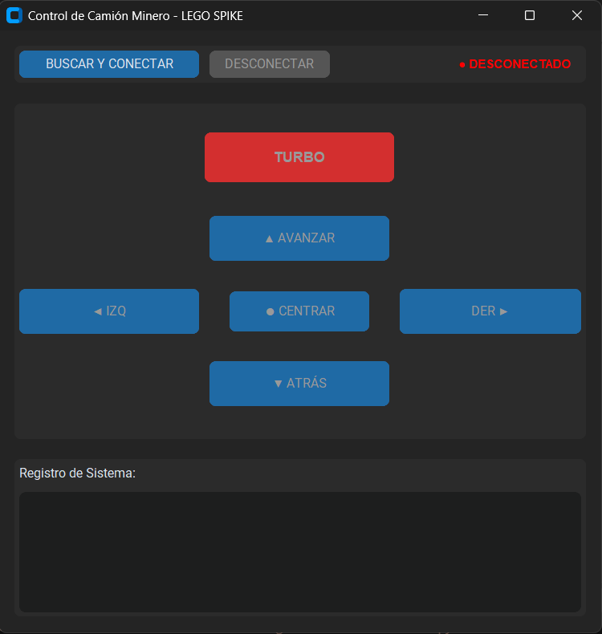

# Lego Spike Prime - Controller

**Lego Controller** es una herramienta de escritorio desarrollada en Python que permite controlar remotamente un vehículo robotizado Lego Spike Prime. Está diseñada para estudiantes y entusiastas de la robótica que buscan una experiencia de manejo precisa mediante una interfaz gráfica (GUI) o teclado, utilizando conexión Bluetooth (BLE).

## Características
* **Conexión Inalámbrica:** Escaneo y emparejamiento automático con Hubs Lego vía Bluetooth.
* **Control Dual:** Manejo mediante botones en pantalla o teclado físico.
* **Feedback Visual:** Los botones de la interfaz se iluminan al presionar las teclas correspondientes.
* **Modo Turbo:** Botón dedicado para liberar la máxima potencia de los motores.
* **Logs en Tiempo Real:** Consola integrada para visualizar comandos y estado de la conexión.

## Instalación

Este proyecto se ejecuta desde el código fuente. Sigue estos pasos para configurarlo:

### Requisitos previos
* Python 3.8 o superior.
* Hub Lego Spike Prime con firmware **Pybricks**.
* Computadora con Bluetooth activado.

### Pasos

1. **Descargar el proyecto:**
   Clona el repositorio o descarga el archivo ZIP y descomprímelo.
   Comando:
   `git clone https://github.com/AbrahamCode24/Lego_controller_pybricks.git`

2. **Acceder a la carpeta:**
   Una vez descargado, entra al directorio del proyecto:
   Comando:
   `cd Lego_controller_pybricks`

3. **Instalar dependencias:**
   Ejecuta el siguiente comando para instalar las librerías necesarias:
   Comando:
   `pip install -r requirements.txt`

## Uso Básico

1. **Iniciar la aplicación:**
   Ejecuta el archivo principal:
   Comando:
   `python main.py`

2. **Conectar:**
   * Haz clic en **"BUSCAR Y CONECTAR"**.
   * Selecciona tu Hub de la lista.
   * Espera a ver el mensaje "CONECTADO".

3. **Controlar el Robot:**
   Usa los botones de la interfaz o las siguientes teclas:

| Acción         | Tecla |

| **Avanzar**    | Flecha Arriba |
| **Retroceder** | Flecha Abajo |
| **Girar**      | Flecha Izq / Flecha Der |
| **TURBO**      | Enter (Mantener) |
| **Frenar**     | Espacio |

## Capturas

Así se ve la interfaz del controlador:

---
**Desarrollado por:** Grupo 6